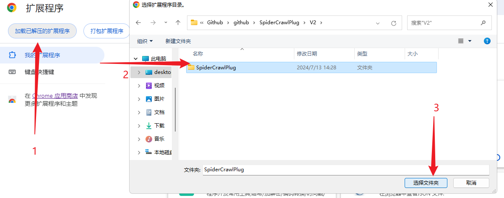
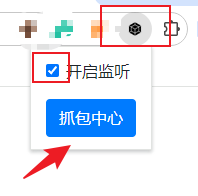
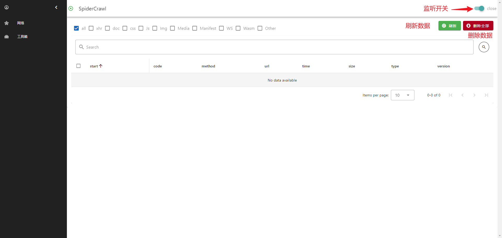
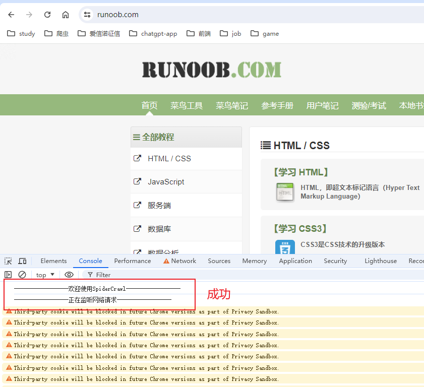
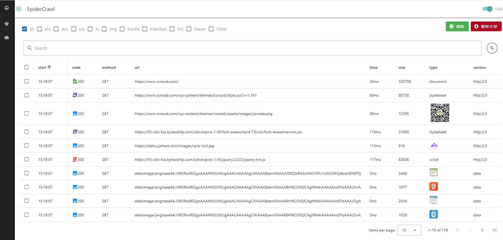
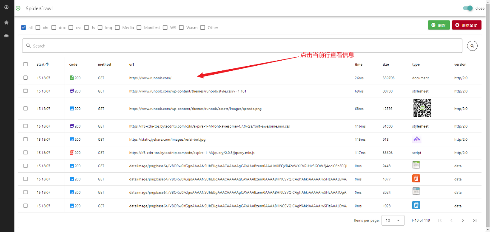
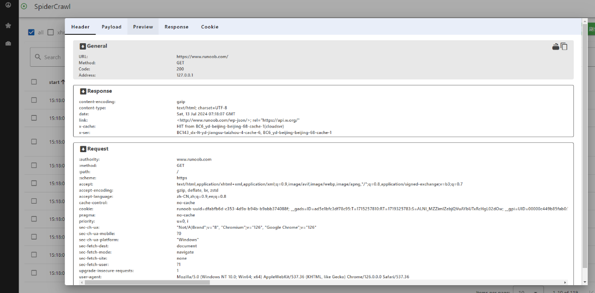
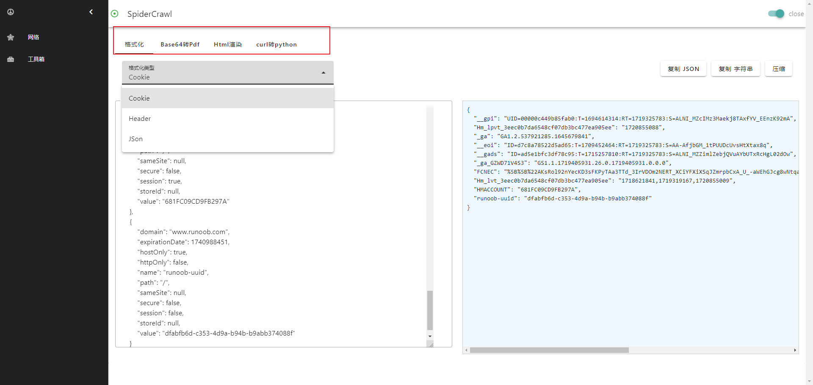

# 1.介绍

`
SpiderCrawlPlug（chrome抓包插件） Google Chrome 网页包捕获插件、网络爬虫数据包捕获、数据包捕获插件、Google 插件、抓包插件。
`
`Google Chrome web packet capture plugin, web crawler packet capture, packet capture plugin, Google plugin.`

# 2.安装方式

`安装完成,如果抓包失败需要重启浏览器`

1. [GitHub](https://github.com/peng0928/SpiderCrawlPlug)
2. [下载链接](https://github.com/peng0928/SpiderCrawlPlug/archive/refs/heads/main.zip)
`最新版请选择V2版本`
- 在chrome拓展页面加载已解压的拓展程序，如图
  

# 3.使用教程

### 3.1 打开监听按钮、抓包中心

### 3.2 在页面打开开发者模式然后刷新页面

`抓包失败重新打开新页面进行重试`

### 3.3 在抓包中心重新刷新页面即可看到抓包数据

# 4.功能介绍
## 4.1 查看数据

## 4.2 工具箱

# 5.更新日志
## V1.0.0
- 新增页面抓包开关控制
- 新增报文、请求参数、响应内容复制功能

# 问题

[给作者提bug](https://github.com/peng0928/SpiderCrawlPlug/issues)