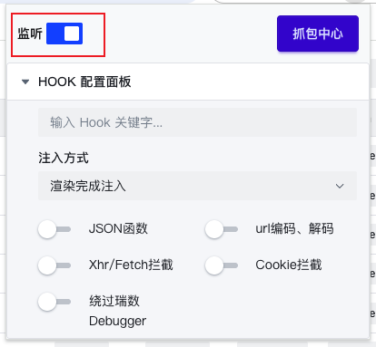
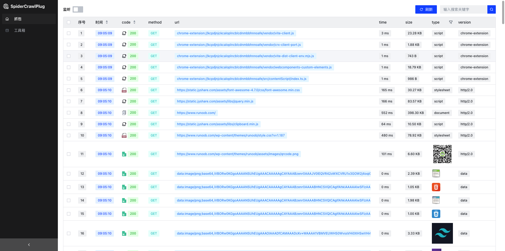
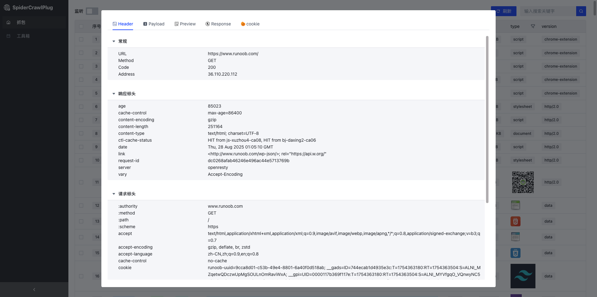
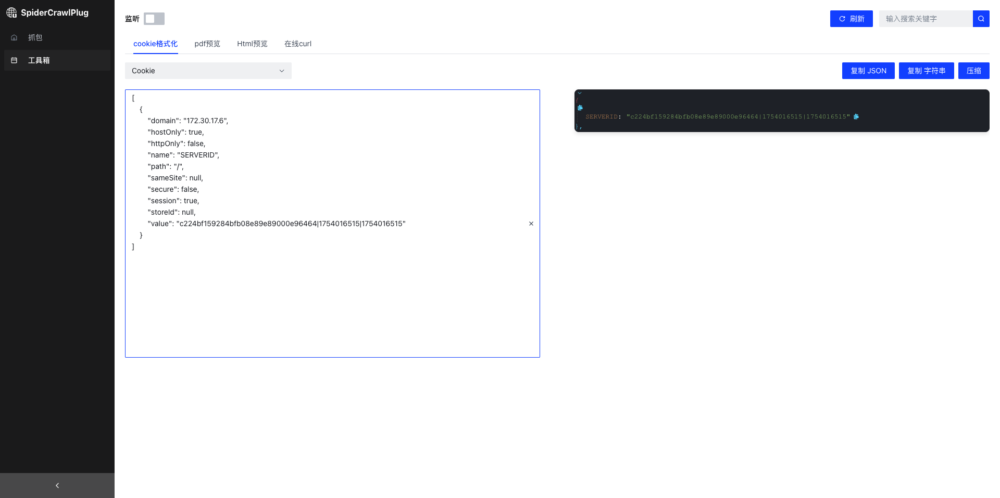

# 1.介绍

`
SpiderCrawlPlug（chrome抓包插件） Google Chrome 网页包捕获插件、网络爬虫数据包捕获、数据包捕获插件、Google 插件、抓包插件。
`
`Google Chrome web packet capture plugin, web crawler packet capture, packet capture plugin, Google plugin.`

# ⚠️注

- 最新版本chrome浏览器请使用V3版本，旧版本请使用V2版本，32位的chrome请使用V1版本

# 2.安装方式

`安装完成,如果抓包失败需要重启浏览器`

1. [GitHub](https://github.com/peng0928/SpiderCrawlPlug)
2. [最新版下载链接](https://github.com/peng0928/SpiderCrawlPlug/releases/download/v3.0.0/SpiderCrawlPlug3.zip)
3. [下载地址](https://github.com/peng0928/SpiderCrawlPlug/releases)
   `最新版请选择V2版本, chrome 64位的版本建议使用V2版本, chrome 32位的版本建议使用V1版本`

- 在chrome拓展页面加载已解压的拓展程序，如图
  

# 3.使用教程

## 3.1 打开监听按钮、抓包中心

## 3.2 在页面打开开发者模式然后刷新页面

`抓包失败重新打开新页面进行重试`

## 3.3 在抓包中心重新刷新页面即可看到抓包数据

# 4.功能介绍

## 4.1 查看数据

## 4.2 工具箱

# 5.更新日志

## V1.0.0

- 🚀新增页面抓包开关控制
- 🚀新增报文、请求参数、响应内容复制功能

## V2.0.0

- 🚀新增hook功能(2025.05.07 已发布)
- 🚀新增hook debugger功能。参考博客（https://blog.csdn.net/2406_83321119/article/details/147606475）

## V3.0.0

- 🚀全新的简洁的UI界面😍
- 🚀适配最新版浏览器😍
- 🚀支持右键一键复制

# 联系方式

- 微信(麻烦备注一下: 抓包插件): penr1314
  [给作者提bug](https://github.com/peng0928/SpiderCrawlPlug/issues)
