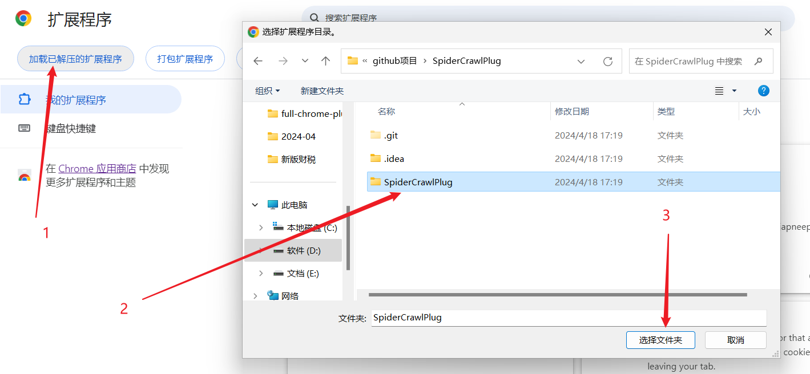
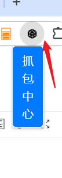
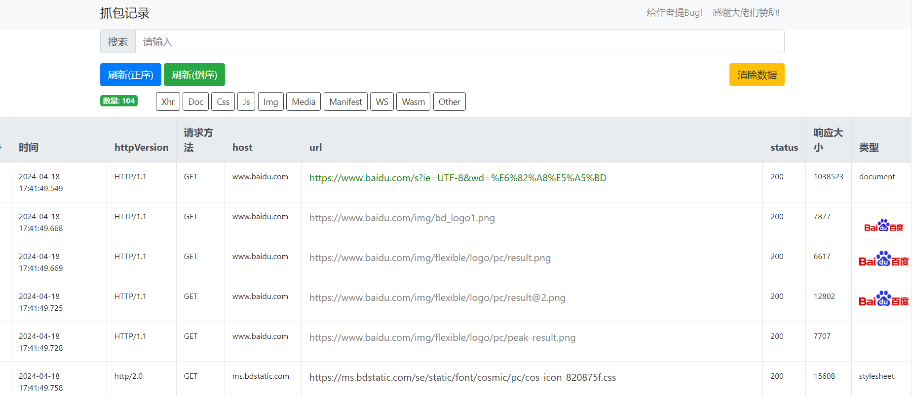

# SpiderCrawlPlug（chrome抓包插件）
`
Google Chrome 网页包捕获插件、网络爬虫数据包捕获、数据包捕获插件、Google 插件、抓包插件。
`
`Google Chrome web packet capture plugin, web crawler packet capture, packet capture plugin, Google plugin.`

## 安装方式(安装完成需要重启浏览器)
1. [GitHub](https://github.com/peng0928/SpiderCrawlPlug)
2. [下载链接](https://github.com/peng0928/SpiderCrawlPlug/archive/refs/heads/main.zip)
温馨提示:
- window用户使用SpiderCrawlPlug.zip, mac用户使用SpiderCrawlPlug.crx
将压缩包托至谷歌拓展页面即可
- 也可以提供拓展页面加载已解压的拓展程序，如图
  

## 使用教程
1. 打开抓包中心
   
   
3. 在页面打开开发者模式然后刷新页面（抓包失败重新打开新页面进行重试）
   
3.在抓包中心重新刷新页面即可看到抓包数据
  
## 问题
[给作者提bug](https://github.com/peng0928/SpiderCrawlPlug/issues)